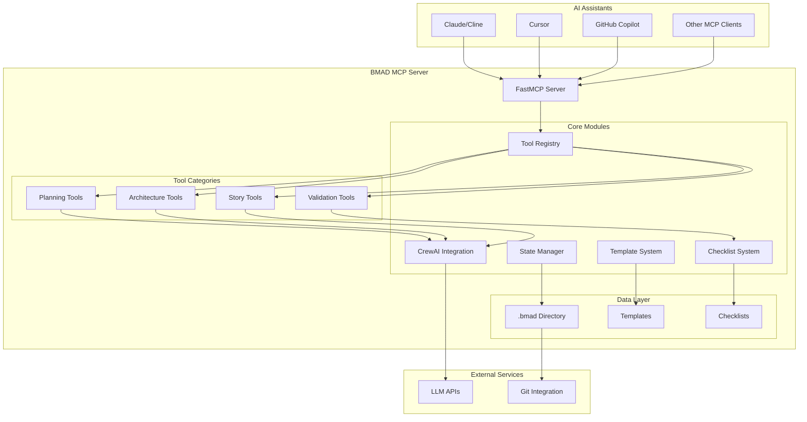
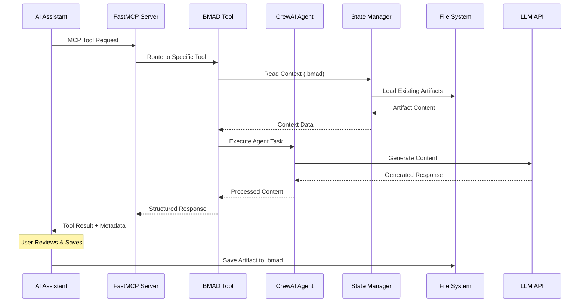

# Technical Architecture Document
## BMAD MCP Server - Comprehensive AI-Driven Development Methodology Platform

---

**Document Information:**
- **Version:** 1.0
- **Created:** 2025-05-25
- **Status:** Draft
- **Architecture Type:** Modular Monolith
- **Complexity Score:** 7/10 (Moderate-High)
- **Methodology:** BMAD (Breakthrough Method of Agile AI-driven Development)

---

## 1. Technical Summary

The BMAD MCP Server is a sophisticated modular monolith designed to operationalize the BMAD methodology through standardized Model Context Protocol (MCP) tools. The architecture emphasizes modularity, AI agent integration via CrewAI, and file-based artifact management while providing enterprise-grade reliability and performance.

**Key Technical Characteristics:**
- **Architecture Style:** Modular Monolith with clear domain boundaries
- **Primary Language:** Python 3.11+
- **Core Framework:** FastMCP for MCP protocol handling
- **AI Integration:** CrewAI for multi-agent orchestration
- **Protocol:** MCP (Model Context Protocol) for AI assistant communication
- **Data Storage:** File-based artifact management in `.bmad` directory structure
- **Deployment:** Containerized with Docker for consistent environments
- **Integration:** Universal MCP compatibility (Claude, Cursor, Cline, GitHub Copilot)

## 2. High-Level Overview

### 2.1 System Architecture Diagram



### 2.2 Request Flow Diagram



## 3. Architectural/Design Patterns Adopted

### 3.1 Core Patterns

**1. Modular Monolith Pattern**
- Single deployable unit with clear module boundaries
- Domain-driven separation (Planning, Architecture, Story, Validation)
- Shared utilities and infrastructure components

**2. Tool Pattern (Command Pattern)**
- Each BMAD capability implemented as a discrete tool
- Consistent interface via `BMadTool` base class
- Standardized input/output schemas using Pydantic

**3. Agent Orchestration Pattern**
- CrewAI agents represent BMAD personas (Analyst, PM, Architect)
- Task-based execution with defined roles and goals
- Multi-agent collaboration for complex workflows

**4. Template Method Pattern**
- Standardized BMAD artifact generation using templates
- Consistent structure across all document types
- Extensible template system for customization

**5. Strategy Pattern**
- Multiple checklist strategies for validation
- Configurable validation modes (strict, standard, lenient)
- Pluggable quality assessment approaches

### 3.2 Integration Patterns

**1. Protocol Adapter Pattern**
- FastMCP handles MCP protocol compliance
- Abstraction layer for different transport modes (stdio, SSE)
- Version compatibility and error handling

**2. Repository Pattern**
- `StateManager` provides consistent file access interface
- Abstraction over `.bmad` directory structure
- Centralized artifact lifecycle management

## 4. Component View

### 4.1 FastMCP Server Layer

**Purpose:** MCP protocol implementation and tool registration
**Location:** `src/bmad_mcp_server/server.py`
**Responsibilities:**
- MCP protocol compliance and message handling
- Tool discovery and registration
- Request routing and response formatting
- Transport mode management (stdio/SSE)

**Key Classes:**
- `BMadMCPServer`: Main server implementation
- Tool registration and lifecycle management
- Configuration and logging setup

### 4.2 Tool System

**Purpose:** BMAD methodology implementation as MCP tools
**Location:** `src/bmad_mcp_server/tools/`
**Structure:**
```
tools/
├── base.py                    # BMadTool base class
├── planning/                  # Project planning tools
│   ├── project_brief.py      # CreateProjectBriefTool
│   ├── generate_prd.py       # GeneratePRDTool
│   └── validate_requirements.py # ValidateRequirementsTool
├── architecture/             # Architecture design tools
│   ├── create_architecture.py # CreateArchitectureTool
│   └── frontend_architecture.py # CreateFrontendArchitectureTool
├── story/                    # Story management tools
│   ├── create_story.py       # CreateNextStoryTool
│   └── validate_story.py     # ValidateStoryTool
└── validation/               # Quality assurance tools
    ├── run_checklist.py      # RunChecklistTool
    └── correct_course.py     # CorrectCourseTool
```

**Key Design Principles:**
- All tools inherit from `BMadTool` base class
- Pydantic schemas for input validation
- Structured output with content, metadata, and suggestions
- No direct file writing - tools return content for user approval

### 4.3 CrewAI Integration Layer

**Purpose:** AI agent orchestration for complex content generation
**Location:** `src/bmad_mcp_server/crewai_integration/`
**Components:**
- `agents.py`: BMAD persona definitions (Analyst, PM, Architect)
- `config.py`: LLM configuration and agent setup

**Agent Roles:**
- **Analyst Agent**: Project brief generation and analysis
- **PM Agent**: PRD creation and story management
- **Architect Agent**: Technical and frontend architecture design

### 4.4 State Management System

**Purpose:** Artifact lifecycle and `.bmad` directory management
**Location:** `src/bmad_mcp_server/utils/state_manager.py`
**Responsibilities:**
- `.bmad` directory structure management
- Artifact reading and metadata parsing
- YAML frontmatter handling for Markdown files
- Project state tracking and context provision

**Directory Structure Managed:**
```
.bmad/
├── ideation/          # Project briefs and initial concepts
├── prd/              # Product Requirements Documents
├── architecture/     # Technical architecture documents
├── stories/          # User stories and development tasks
├── checklists/       # Validation reports and quality assessments
└── decisions/        # Course corrections and change management
```

### 4.5 Template System

**Purpose:** Standardized BMAD artifact generation
**Location:** `src/bmad_mcp_server/templates/`
**Components:**
- `loader.py`: Template loading and caching
- Template files for each artifact type:
  - `project_brief_tmpl.md`
  - `prd_tmpl.md`
  - `architecture_tmpl.md`
  - `frontend_architecture_tmpl.md`
  - `story_tmpl.md`
  - `course_correction_tmpl.md`

### 4.6 Checklist System

**Purpose:** Quality validation and BMAD compliance checking
**Location:** `src/bmad_mcp_server/checklists/`
**Components:**
- `loader.py`: Checklist loading and execution engine
- Quality checklists:
  - `pm_checklist.md`: Product Manager quality standards
  - `architect_checklist.md`: Architecture validation
  - `frontend_architecture_checklist.md`: Frontend-specific checks
  - `story_draft_checklist.md`: Story draft validation
  - `story_dod_checklist.md`: Definition of Done checks
  - `story_review_checklist.md`: Story review criteria
  - `change_checklist.md`: Change management validation

## 5. Project Structure

```
bmad-mcp-server/
├── README.md
├── pyproject.toml              # Python project configuration
├── Dockerfile                 # Container build instructions
├── docker-compose.yml         # Multi-service orchestration
├── .env.example               # Environment variable template
├── .gitignore
├── mkdocs.yml                 # Documentation configuration
├── src/
│   └── bmad_mcp_server/
│       ├── __init__.py
│       ├── main.py            # CLI entry point
│       ├── server.py          # FastMCP server implementation
│       ├── tools/             # BMAD tool implementations
│       │   ├── __init__.py
│       │   ├── base.py        # BMadTool base class
│       │   ├── planning/      # Project planning tools
│       │   ├── architecture/  # Architecture design tools
│       │   ├── story/         # Story management tools
│       │   └── validation/    # Quality assurance tools
│       ├── crewai_integration/ # AI agent orchestration
│       │   ├── __init__.py
│       │   ├── agents.py      # BMAD persona definitions
│       │   └── config.py      # CrewAI configuration
│       ├── templates/         # BMAD artifact templates
│       │   ├── __init__.py
│       │   ├── loader.py      # Template management
│       │   └── *.md           # Template files
│       ├── checklists/        # Quality validation checklists
│       │   ├── __init__.py
│       │   ├── loader.py      # Checklist execution engine
│       │   └── *.md           # Checklist definitions
│       └── utils/             # Shared utilities
│           ├── __init__.py
│           ├── logging.py     # Logging configuration
│           └── state_manager.py # Artifact management
├── docs/                      # MkDocs documentation
│   ├── index.md
│   ├── getting-started.md
│   ├── configuration.md
│   ├── development-workflow.md
│   ├── ide-integration.md
│   ├── tool_catalog.md
│   ├── docker-deployment.md
│   └── troubleshooting.md
├── tests/                     # Test suite
│   ├── __init__.py
│   ├── test_basic.py
│   └── conftest.py
└── scripts/                   # Utility scripts
    ├── start_stdio.py
    └── start_sse.py
```

## 6. API Reference

### 6.1 MCP Tools API

The server exposes BMAD capabilities through standardized MCP tools:

**Planning Tools:**
- `create_project_brief`: Generate structured project briefs
- `generate_prd`: Create comprehensive PRDs with epics and stories
- `validate_requirements`: Validate PRDs against PM quality checklists

**Architecture Tools:**
- `create_architecture`: Generate technical architecture documents
- `create_frontend_architecture`: Design frontend-specific architectures

**Story Tools:**
- `create_next_story`: Generate development-ready user stories
- `validate_story`: Validate stories against Definition of Done

**Validation Tools:**
- `run_checklist`: Execute BMAD quality checklists
- `correct_course`: Handle change management scenarios

### 6.2 Tool Input/Output Schema

All tools follow a consistent pattern:

**Input:** Pydantic-validated JSON schema
**Output:** Structured dictionary containing:
```json
{
  "content": "Generated artifact content (Markdown)",
  "suggested_path": "Relative path within .bmad directory",
  "metadata": {
    "artifact_type": "Type of artifact",
    "status": "draft|review|approved",
    "generated_by_tool": "Tool name",
    "timestamp": "ISO timestamp",
    // Additional tool-specific metadata
  },
  "message": "User-friendly completion message"
}
```

## 7. Data Models and Storage

### 7.1 Artifact Storage Strategy

**File-Based Approach:**
- All artifacts stored as Markdown files with YAML frontmatter
- Hierarchical organization within `.bmad` directory
- Git-friendly format for version control
- Human-readable and editable

**Metadata Management:**
- YAML frontmatter for artifact metadata
- Consistent schema across all artifact types
- Status tracking and lifecycle management
- Tool provenance and generation timestamps

### 7.2 State Management

**StateManager Responsibilities:**
- Directory structure initialization and maintenance
- Artifact reading with metadata parsing
- Context provision for tool execution
- No direct writing - tools return content for user approval

## 8. Definitive Tech Stack Selections

### 8.1 Core Technologies

**Runtime Environment:**
- **Python 3.11+**: Primary implementation language
- **FastMCP**: MCP protocol implementation and server framework
- **CrewAI**: Multi-agent AI orchestration
- **Pydantic**: Data validation and schema management

**Development Tools:**
- **Poetry/pip**: Dependency management
- **pytest**: Testing framework
- **black/isort**: Code formatting
- **mypy**: Static type checking
- **MkDocs**: Documentation generation

### 8.2 Deployment Stack

**Containerization:**
- **Docker**: Application containerization
- **Docker Compose**: Multi-service orchestration
- **Multi-stage builds**: Optimized container images

**Configuration Management:**
- **Environment variables**: Sensitive configuration (API keys)
- **JSON configuration files**: Structured settings
- **YAML frontmatter**: Artifact metadata

## 9. Infrastructure and Deployment Overview

### 9.1 Deployment Modes

**Local Development:**
- Direct Python execution with virtual environments
- Stdio mode for AI assistant integration
- File-based artifact management

**Containerized Deployment:**
- Docker containers for consistent environments
- SSE mode for network-accessible service
- Volume mounts for artifact persistence

### 9.2 Scalability Considerations

**Current Architecture:**
- Single-instance deployment
- File-based storage suitable for individual/team use
- Stateless tool execution with context from files

**Future Scalability:**
- Horizontal scaling via load balancing
- Database migration for multi-user scenarios
- Distributed artifact storage for enterprise use

## 10. Error Handling Strategy

### 10.1 Tool-Level Error Handling

- Pydantic validation for input parameters
- Structured error responses with user guidance
- Graceful degradation for external service failures
- Comprehensive logging for debugging

### 10.2 System-Level Resilience

- FastMCP protocol error handling
- CrewAI agent failure recovery
- File system error management
- LLM API rate limiting and retry logic

## 11. Security Best Practices

### 11.1 API Key Management

- Environment variable storage for LLM API keys
- No hardcoded credentials in source code
- Secure container environment variable handling

### 11.2 File System Security

- Restricted file operations within project boundaries
- Path validation and sanitization
- User approval required for all file modifications

### 11.3 Network Security

- Optional authentication for SSE mode
- HTTPS support for production deployments
- Input validation and sanitization

## 12. Overall Testing Strategy

### 12.1 Testing Approach

**Unit Testing:**
- Individual tool functionality
- CrewAI agent behavior
- State management operations
- Template and checklist loading

**Integration Testing:**
- End-to-end tool execution
- MCP protocol compliance
- File system operations

**Quality Assurance:**
- BMAD methodology compliance
- Generated artifact quality
- Checklist validation accuracy

### 12.2 Test Infrastructure

- pytest framework with async support
- Mock LLM responses for consistent testing
- Temporary file system for isolated tests
- CI/CD pipeline integration

---

## Initial Architect Prompt

Based on the requirements analysis above, please create a comprehensive technical architecture that:

1. **Supports all functional and non-functional requirements**
2. **Follows the technical assumptions and constraints outlined**
3. **Provides clear technology stack selections with justification**
4. **Includes detailed component design and data flow**
5. **Addresses security, scalability, and performance considerations**
6. **Optimizes for AI agent implementation and BMAD methodology**

Use the BMAD architecture template and ensure the design enables efficient development execution by AI agents following the defined epics and stories.
